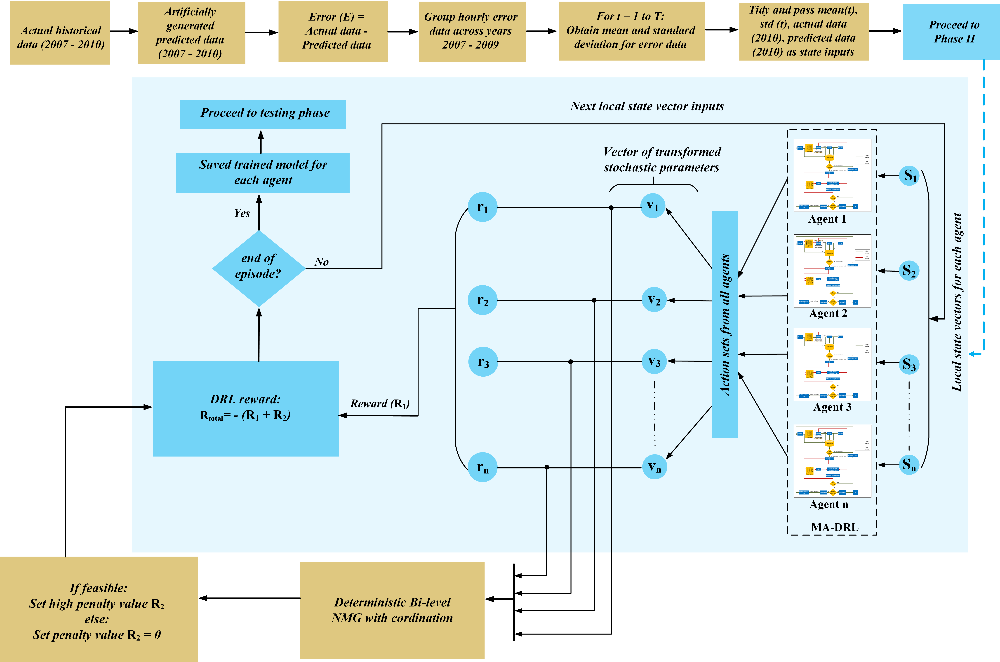
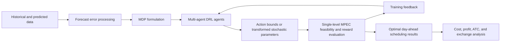

# Lean Multi-Agent Deep Reinforcement Learning for 30-Bus Networked Microgrid Energy Management

This repository contains the code and data assets for studying **networked microgrid energy management under renewable generation and load uncertainties**. The project builds on a Lean Multi-Agent Deep Reinforcement Learning (L-MADRL) framework in which multiple agents coordinate energy scheduling decisions across a networked microgrid environment while technical feasibility is enforced through an optimization-based evaluation layer.

<p align="center">
  
</p>

---

## Project Overview

Coordinating energy exchanges among multiple microgrids is challenging because each participant must respond to uncertain renewable generation, uncertain load demand, market interactions, network limits, and operational constraints. This project addresses those challenges using a **lean multi-agent learning framework** supported by a mathematical programming layer.

The project focuses on:

1. **Networked microgrid energy management**: Modeling coordinated day-ahead scheduling among electricity retailers (ERs), microgrids (MGs), and the transmission network.
2. **Uncertainty handling**: Representing renewable generation and demand uncertainties using historical and predicted data.
3. **Multi-agent DRL decision-making**: Training learning agents to select actions that guide scheduling decisions under uncertainty.
4. **Optimization-based feasibility checking**: Embedding operational and network constraints through a single-level mathematical program derived from a bilevel formulation.
5. **Benchmarking**: Comparing the DRL-based strategy with deterministic and stochastic optimization baselines.

---

## Research Context

The methodology is based on the L-MADRL framework reported in:

> Ayodele Benjamin Esan, Hussain Shareef, Ahmad K. ALAhmad,  
> **Lean multi-agent deep reinforcement learning for uncertainty handling in the energy management of networked microgrids**,  
> *Applied Energy*, Volume 408, 2026, Article 127354.  
> DOI: [10.1016/j.apenergy.2026.127354](https://doi.org/10.1016/j.apenergy.2026.127354)

The published article presents the core L-MADRL framework for networked microgrid energy management. This repository organizes the **30-bus implementation assets**, including DRL codes, deterministic optimization codes, stochastic optimization codes, generation shift factor values, and supplementary electricity retailer and microgrid parameters.

---

## Methodological Framework

The framework combines learning, optimization, and power system modeling.

### 1. Data Preparation and Uncertainty Modeling

Historical and predicted data are used to characterize uncertain renewable generation and load demand. Forecast errors are processed to support uncertainty-aware decision-making in the scheduling model.

### 2. Networked Microgrid Formulation

The system is modeled as a networked microgrid environment with multiple ERs and MGs. The ERs seek profitable and secure energy transactions, while MGs seek cost-effective operation subject to generation, storage, exchange, and network constraints.

### 3. Lean Multi-Agent DRL Layer

Each DRL agent observes a local state vector and selects actions associated with transformed stochastic parameters or decision bounds. The lean design reduces the burden placed directly on the learning agents by allowing the optimization layer to manage detailed technical constraints.

### 4. Single-Level Optimization Layer

The lower-level microgrid scheduling problem is reformulated using Karush-Kuhn-Tucker (KKT) optimality conditions. This converts the bilevel energy management problem into a single-level mathematical program with equilibrium constraints (MPEC), enabling systematic feasibility checking and reward evaluation.

### 5. Reward and Feasibility Feedback

The optimization layer evaluates the actions selected by the DRL agents. Feasible actions are rewarded according to economic and network-aware performance, while infeasible actions receive penalty feedback. This allows the agents to learn policies that are both economically useful and technically feasible.

### 6. Benchmarking and Comparative Analysis

The DRL-based strategy is compared with deterministic and stochastic optimization cases. The included archive files also support analysis using generation shift factor values and supplementary system parameters.

---

## Framework at a Glance



---

## Important Concepts

| Term | Meaning in this project |
|---|---|
| **NMG** | Networked microgrid system consisting of interconnected microgrids and electricity retailers. |
| **ER** | Electricity retailer participating in energy exchange and market coordination. |
| **MG** | Microgrid with local demand, distributed generation, storage, and operational constraints. |
| **L-MADRL** | Lean Multi-Agent Deep Reinforcement Learning framework for coordinated decision-making. |
| **L-MADQN** | Multi-agent Deep Q-Network implementation used within the L-MADRL framework. |
| **ATC** | Available Transfer Capability, used to represent secure network-aware transfer limits. |
| **MPEC** | Mathematical Program with Equilibrium Constraints, derived from the KKT reformulation of the lower-level problem. |
| **GSF** | Generation Shift Factor values used to represent the sensitivity of network flows to power injections. |

---

## Repository Structure

The repository is organized as compressed code and data packages.

```text
30bus-Lean-Multi-Agent-DRL-Project
├── DRL codes and data 30 bus.zip                  # Multi-agent DRL implementation and 30-bus case data
├── Deterministic code with data.zip               # Deterministic optimization benchmark
├── Stochastic optimization code with data.zip     # Stochastic optimization benchmark
├── GSF values.zip                                 # Generation shift factor data used for network constraints
├── Supplementary materials (ER and MG parameters).zip
│                                                    # Electricity retailer and microgrid parameters
└── README.md                                      # Project documentation
```

A suggested extracted working structure is:

```text
30bus-Lean-Multi-Agent-DRL-Project
├── drl_case
├── deterministic_case
├── stochastic_case
├── gsf_values
├── supplementary_materials
└── README.md
```

---

## Getting Started

### 1. Clone the Repository

```bash
git clone https://github.com/esanben/30bus-Lean-Multi-Agent-DRL-Project.git
cd 30bus-Lean-Multi-Agent-DRL-Project
```

### 2. Extract the Project Archives

```bash
unzip "Supplementary materials (ER and MG parameters).zip" -d supplementary_materials
unzip "GSF values.zip" -d gsf_values
unzip "Deterministic code with data.zip" -d deterministic_case
unzip "Stochastic optimization code with data.zip" -d stochastic_case
unzip "DRL codes and data 30 bus.zip" -d drl_case
```

### 3. Install the Required Software

The exact requirements should be verified from the scripts and notebooks inside each extracted archive. A typical setup for this class of project includes:

- Python 3.8 or higher
- NumPy, pandas, SciPy, and Matplotlib
- A deep learning framework compatible with the DRL scripts
- A mathematical optimization solver compatible with the deterministic, stochastic, and MPEC formulations
- Jupyter Notebook or an equivalent Python development environment

### 4. Recommended Execution Order

Run the project in the following order for a clean comparison across methods:

1. Extract supplementary ER and MG parameter files.
2. Extract GSF values and confirm that network data are available to the optimization scripts.
3. Run the deterministic optimization benchmark.
4. Run the stochastic optimization benchmark.
5. Train and test the L-MADRL or L-MADQN model using the DRL code package.
6. Compare operating cost, ER profit, ATC profile, power exchange, and computational performance.

---

## Expected Outputs

Depending on the specific scripts executed, the project may generate:

- Day-ahead scheduling decisions for ERs and MGs
- Microgrid operating cost profiles
- Electricity retailer profit profiles
- Power exchange schedules among network participants
- ATC and network security indicators
- DRL training and testing performance metrics
- Comparative results against deterministic and stochastic optimization benchmarks

---

## Academic Contribution

This project is academically motivated by the need for scalable and feasible decision-making tools in networked microgrids. The key contribution is the coupling of a **multi-agent DRL policy-learning layer** with an **optimization-based feasibility layer**. This structure reduces the complexity handled directly by learning agents while preserving physical and market constraints through mathematical programming.

In practical terms, the framework supports:

- More reliable learning under renewable and load uncertainty
- Feasible energy scheduling under network and operational constraints
- Market-aware coordination between ERs and MGs
- Computationally efficient comparison with optimization-based benchmarks

---

## Citation

If this repository or its methodology supports your work, please cite the associated paper:

```bibtex
@article{Esan2026LeanMADRL,
  title   = {Lean multi-agent deep reinforcement learning for uncertainty handling in the energy management of networked microgrids},
  author  = {Esan, Ayodele Benjamin and Shareef, Hussain and ALAhmad, Ahmad K.},
  journal = {Applied Energy},
  volume  = {408},
  pages   = {127354},
  year    = {2026},
  doi     = {10.1016/j.apenergy.2026.127354}
}
```

---

## Notes on Reproducibility

Because the repository currently stores the project as compressed archives, keep the extracted folders in a consistent directory structure before running the scripts. If paths are hard-coded inside any notebook or script, update them to match your local machine before execution.

For best reproducibility, record:

- Python version
- Package versions
- Solver name and version
- Random seeds used during DRL training
- Hardware information, especially CPU and GPU details

---

## License

This project is licensed under the MIT License. You are free to use, modify, and distribute the code, provided that the original copyright and license notice are retained.

See the [LICENSE](LICENSE) file for details.

---

## About Me

I am **Ayodele Benjamin Esan**. I hold a doctorate in Electrical Engineering with a focus on Deep Reinforcement Learning applications in Energy Systems. I am interested in building intelligent, data-driven, and optimization-aware systems for modern power and energy applications.

Feel free to connect with me on:

[](https://www.linkedin.com/in/ayodele-benjamin-esan-ph-d-03b948106)
[](https://github.com/esanben)
[](https://medium.com/@esanayodele.benjamin)

